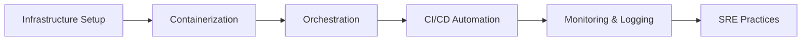

# 👋 Hello, I'm Udhayaprakash J

**DevOps & Cloud Engineer** | Chennai, Tamil Nadu  
*Building scalable, secure cloud infrastructure with passion for automation*

---

## 🚀 About Me

Motivated DevOps & Cloud Engineer with expertise in designing and automating scalable, secure cloud solutions using AWS, CI/CD pipelines, Docker, Kubernetes, and Infrastructure as Code. Passionate about implementing modern DevOps practices to drive efficiency and continuous improvement.

- 🔭 Currently working on: Advanced Kubernetes deployments with EKS
- 🌱 Learning: Advanced SRE practices & cloud cost optimization strategies
- 💬 Ask me about: AWS, Docker, Kubernetes, CI/CD, Terraform
- 📫 How to reach me: judhayaprakash27052001@gmail.com

---

## 🛠️ Tech Stack

### Cloud Platforms

### DevOps Tools

### Infrastructure & Monitoring

### Programming & Scripting

### Databases

---

## 🏆 Featured Projects

### 🌐 Secure Web Application for Financial Transactions

*Built an intuitive loan processing interface using HTML/CSS and React with focus on responsive UI and validation logic*

### 🔄 CI/CD Pipeline with Jenkins & Docker

*Designed Jenkins pipeline for automated build, test, and deployment with Docker containers on AWS EC2*

### 📱 Serverless Contact Book (AWS)

*Serverless web app using Lambda, API Gateway, DynamoDB, S3, and CloudFront with secure API endpoints*

---

## 📈 GitHub Stats

  

---

## 📊 DevOps Journey

---

## 🎓 Education & Certifications

### 📚 Education
**Master in Software Engineering**  
*Vellore Institute of Technology, Chennai*  
M. Tech (Software Engineering) | CGPA: 7.69 | 2024

### 📜 Certifications
- -000?&logo=Microsoft-Azure)
- 

---

## 💼 Experience

### AI Prompt Intern – TMIS IT Solutions (Mar 2025)
*Designed, tested, and refined text prompts to train AI-powered tools including virtual tutors, mentors, and conversational agents. Developed effective prompt strategies to improve model responses and enhance human-AI interaction.*

---

## 🎯 Fields of Interest

- **Cloud Computing**: AWS, Azure, GCP
- **DevOps Practices**: CI/CD, Automation, Infrastructure as Code
- **Containerization**: Docker, Kubernetes, EKS
- **Site Reliability Engineering**: Monitoring, Alerting, Incident Management
- **Cloud Security**: IAM, Security Groups, Compliance
- **Cost Optimization**: Cloud spend management, Resource optimization

---

## 📞 Let's Connect!

I'm always open to discussing **DevOps**, **Cloud technologies**, or potential collaboration opportunities!

---

  

*"Automation applied to an inefficient operation will magnify the inefficiency." – Bill Gates*

